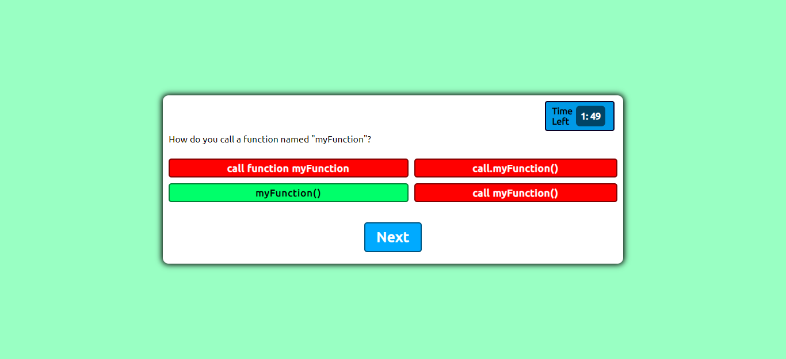

# Code Quiz

## Description

This a multiple choice quiz based on programming languages.

## Table of Contents

1. [INSTALLATION](#Installation)
2. [USAGE](#Usage)
3. [TESTS](#Tests)
4. [QUESTIONS](#Questions)
5. [LICENSE](#License)

## Installation

Clone the repo.

## Usage

n/a

## Technologies Used

- HTML 
- CSS 
- Javascript 

## Tests

No testing was done on this application.

## Questions

If you have any questions or concerns pertaining to this project, please do not hesitate to contact me at tschram93.dev@gmail.com and you can find me on github at https://github.com/Tschram93

## License

Licensed under the [MIT](https://opensource.org/licenses/MIT) license.
